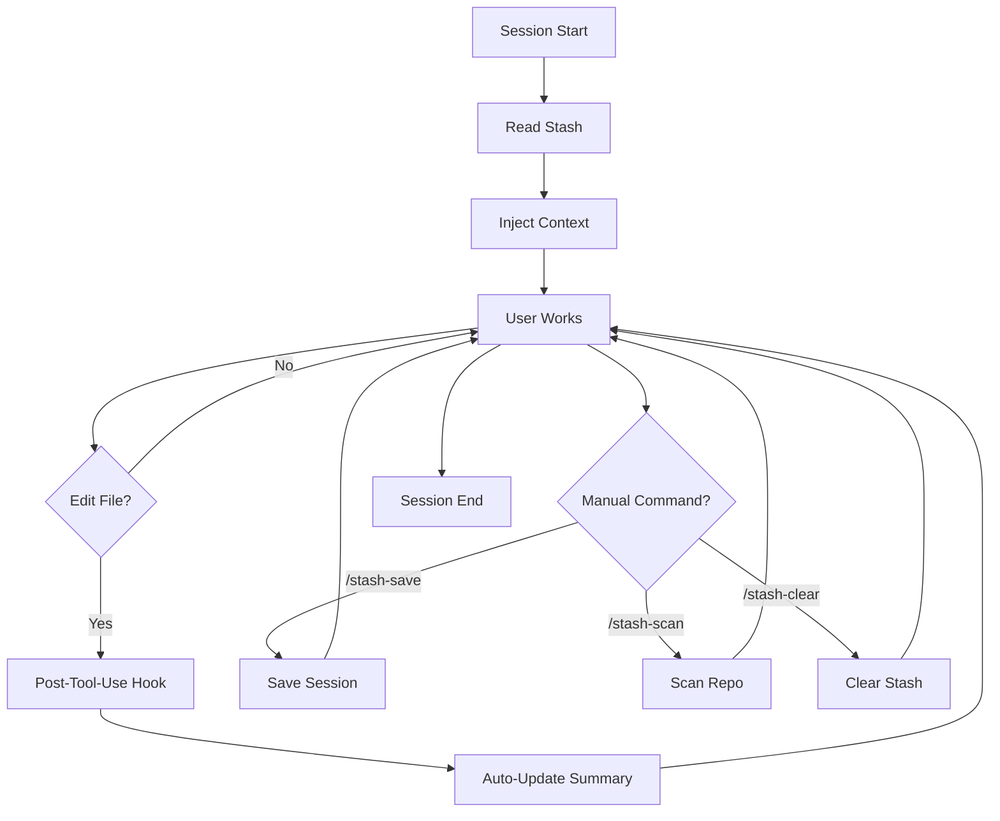

## Overview

TokenStash operates on a continuous read-write cycle throughout your Claude Code session. Understanding this lifecycle helps you know when context is loaded and when summaries are updated.



## Phase 1: Session Start (Read)

### When It Happens

The `SessionStart` hook runs automatically when:
- You launch a new Claude Code session (`startup`)
- You resume an existing session (`resume`)
- You clear the conversation history (`clear`)
- You compact the context window (`compact`)

<Info>
Configured in `hooks/hooks.json` with matcher: `"startup|resume|clear|compact"`
</Info>

### What Happens

The `session-start` hook executes and:

<Steps>
  <Step title="Find Stash Locations">
    ```bash hooks/session-start:11-20
    GLOBAL_STASH_DIR="${HOME}/.claude/tokenstash"
    GIT_ROOT=$(git -C "${PWD}" rev-parse --show-toplevel 2>/dev/null || echo "")
    PROJECT_STASH_DIR="${GIT_ROOT}/.tokenstash"
    ```
  </Step>
  
  <Step title="Load Global Stash">
    Reads `preferences.md` and `rules.md` from `~/.claude/tokenstash/`:
    
    ```bash hooks/session-start:36-43
    if [ -d "$GLOBAL_STASH_DIR" ]; then
        for f in preferences.md rules.md; do
            fpath="$GLOBAL_STASH_DIR/$f"
            if [ -f "$fpath" ]; then
                context+="## Global: $f\n$(cat "$fpath")\n\n"
            fi
        done
    fi
    ```
  </Step>
  
  <Step title="Load Project Stash">
    Reads `architecture.md`, `decisions.md`, `rules.md`, and all file summaries:
    
    ```bash hooks/session-start:46-64
    if [ -d "$PROJECT_STASH_DIR" ]; then
        for f in architecture.md decisions.md rules.md; do
            fpath="$PROJECT_STASH_DIR/$f"
            if [ -f "$fpath" ]; then
                context+="## Project: $f\n$(cat "$fpath")\n\n"
            fi
        done
        # Load file summaries
        if [ -d "$PROJECT_STASH_DIR/files" ]; then
            file_count=$(find "$PROJECT_STASH_DIR/files" -name "*.md" | wc -l)
            if [ "$file_count" -gt 0 ]; then
                context+="## File Summaries ($file_count files cached)\n"
                for f in "$PROJECT_STASH_DIR/files/"*.md; do
                    fname=$(basename "$f" .md | tr '__' '/')
                    context+="### $fname\n$(cat "$f")\n\n"
                done
            fi
        fi
    fi
    ```
  </Step>
  
  <Step title="Inject into Context">
    Wraps the combined context in `<tokenstash>` tags and adds to Claude's initial prompt:
    
    ```bash hooks/session-start:71-82
    full_context="<tokenstash>\n${context}\n</tokenstash>"
    cat <<JSONEOF
    {
      "additional_context": "${escaped}",
      "hookSpecificOutput": {
        "hookEventName": "SessionStart",
        "additionalContext": "${escaped}"
      }
    }
    JSONEOF
    ```
  </Step>
</Steps>

<Note>
This is a **synchronous** operation (`"async": false` in hooks.json). Claude waits for the stash to load before responding to your first message.
</Note>

### Result

Claude now has full access to:
- Your personal preferences and global rules
- Project architecture and decision history
- Summaries of all previously indexed files

**No re-reading files. No re-explaining architecture. Just start coding.**

## Phase 2: Working Session (Write)

### Automatic Updates on File Edit

Every time you edit or create a file, the `PostToolUse` hook runs:

#### Hook Configuration

```json hooks/hooks.json:15-26
"PostToolUse": [
  {
    "matcher": "Write|Edit",
    "hooks": [
      {
        "type": "command",
        "command": "'${CLAUDE_PLUGIN_ROOT}/hooks/run-hook.cmd' post-tool-use",
        "async": true
      }
    ]
  }
]
```

<Tip>
The hook is **asynchronous** (`"async": true`), so it doesn't block Claude while updating summaries.
</Tip>

#### Hook Logic

```bash hooks/post-tool-use:21-31
# Only act on Write and Edit tool calls with a file path
if [[ "$tool_name" != "Write" && "$tool_name" != "Edit" ]] || [ -z "$file_path" ]; then
    cat << 'JSONEOF'
{"no_op": true}
JSONEOF
    exit 0
fi

filename=$(basename "$file_path")
reminder="<tokenstash-reminder>You just edited \`${file_path}\`. Use the tokenstash:auto-update skill to update its summary in .tokenstash/files/ now.</tokenstash-reminder>"
```

The hook sends a reminder to Claude, triggering the `auto-update` skill.

#### Auto-Update Skill

Claude then runs the `tokenstash:auto-update` skill silently:

<Accordion title="Step 1: Flatten the file path">
  Convert `/` to `__` for storage:
  
  ```
  src/lib/utils.ts → src__lib__utils.md
  ```
</Accordion>

<Accordion title="Step 2: Write the summary">
  Create or update `.tokenstash/files/<path>.md`:
  
  ```markdown skills/auto-update/SKILL.md:16-21
  **Purpose:** One sentence — what this file does.
  **Key exports:** List the main functions/classes/constants exported.
  **Patterns:** Any notable patterns (e.g. "uses factory pattern", "singleton").
  **Last updated:** YYYY-MM-DD
  ```
</Accordion>

<Accordion title="Step 3: Done (silently)">
  From the skill:
  
  > Do this silently — no need to tell the user unless there's an error.
  
  The summary is updated in the background without interrupting your workflow.
</Accordion>

### When Auto-Update Runs

| Action | Hook Fires? | Summary Updated? |
|--------|-------------|------------------|
| Edit existing file | ✅ Yes | ✅ Yes |
| Write new file | ✅ Yes | ✅ Yes |
| Read file | ❌ No | ❌ No |
| Delete file | ✅ Yes (via Edit) | ✅ Yes (deleted) |
| Run bash command | ❌ No | ❌ No |

<Warning>
The auto-update skill only runs when you use Claude's `Write` or `Edit` tools. If you manually edit files outside Claude, summaries won't update until you run `/stash-save` or `/stash-scan --force`.
</Warning>

## Phase 3: Manual Commands

You can manually trigger stash operations at any time:

<Accordion title="/stash-save" icon="floppy-disk">
  ### Purpose
  Save a full session summary to the stash.

  ### What Happens
  The `tokenstash:save` skill runs and:

  <Steps>
    <Step title="Update decisions.md">
      Append a timestamped entry with session decisions:
      
      ```markdown skills/save/SKILL.md:12-22
      ## YYYY-MM-DD — <one-line session summary>

      **Decisions:**
      - [What was decided and why]
      - [Another decision if applicable]

      **Files changed:** file1.ts, file2.py
      ```
    </Step>
    
    <Step title="Update architecture.md">
      If the structure changed (new modules, patterns, dependencies), rewrite the architecture overview. Otherwise skip.
    </Step>
    
    <Step title="Sweep file summaries">
      For every file you edited/read this session that lacks a summary, write one now using the auto-update format.
    </Step>
    
    <Step title="Report completion">
      "TokenStash saved. Session summary written to .tokenstash/decisions.md."
    </Step>
  </Steps>

  ### When to Use
  - End of a work session
  - After making important architectural decisions
  - Before switching to a different task
</Accordion>

<Accordion title="/stash-scan" icon="radar">
  ### Purpose
  Index the entire repository and build the full stash.

  ### What Happens
  The `tokenstash:scan` skill runs and:

  <Steps>
    <Step title="Find repo root">
      Use `git rev-parse --show-toplevel` to locate the repository root.
    </Step>
    
    <Step title="Discover files">
      List all files, excluding:
      - `.git/`, `node_modules/`, `.tokenstash/`, `dist/`, `build/`, `.next/`
      - Binary files (images, fonts, compiled artifacts)
      - Files over 500 lines (noted but skipped)
    </Step>
    
    <Step title="Summarize each file">
      For each file not yet summarized (or all if `--force`):
      - Read the file
      - Write `.tokenstash/files/<flattened-path>.md`
    </Step>
    
    <Step title="Write architecture.md">
      Generate a high-level overview based on the full codebase structure.
    </Step>
    
    <Step title="Report results">
      Tell the user how many files were summarized and where the stash was written.
    </Step>
  </Steps>

  ### Flags
  - `/stash-scan`: Only summarize new files (skip existing summaries)
  - `/stash-scan --force`: Re-scan everything, overwrite existing summaries

  ### When to Use
  - First time using TokenStash on a project
  - After pulling major changes from teammates
  - When you want to rebuild the entire stash from scratch
</Accordion>

<Accordion title="/stash-clear" icon="trash">
  ### Purpose
  Wipe the project stash (with confirmation).

  ### What Happens
  
  ```markdown commands/stash-clear.md:6-12
  Ask the user: "Are you sure you want to wipe .tokenstash/ for this project? Type YES to confirm."

  If they confirm with YES:
  1. Delete `.tokenstash/` in the current git repo root
  2. Tell them: "TokenStash cleared. Run /stash-scan to rebuild."

  If they don't confirm, do nothing and tell them the stash was not cleared.
  ```

  ### When to Use
  - Starting fresh after major refactoring
  - Testing TokenStash behavior
  - Removing outdated summaries

  <Warning>
  This **permanently deletes** the project stash. Global stash is unaffected.
  </Warning>
</Accordion>

## Lifecycle Timeline Example

Here's a complete session walkthrough:

<Steps>
  <Step title="09:00 AM — Session Start">
    - You open Claude Code
    - `session-start` hook loads global + project stash
    - Claude knows your architecture, decisions, and 50 file summaries
  </Step>
  
  <Step title="09:15 AM — Edit src/api/routes.ts">
    - You ask Claude to add a new API endpoint
    - Claude uses `Edit` tool to modify the file
    - `post-tool-use` hook fires (async)
    - Claude updates `files/src__api__routes.md` in background
  </Step>
  
  <Step title="09:30 AM — Create src/lib/validator.ts">
    - Claude uses `Write` tool to create new file
    - `post-tool-use` hook fires
    - Claude creates `files/src__lib__validator.md`
  </Step>
  
  <Step title="10:00 AM — Run /stash-save">
    - You finish the feature and run `/stash-save`
    - Claude appends to `decisions.md`: "Added validation layer for API inputs"
    - Claude updates `architecture.md` to mention new validator module
    - All edited file summaries are up to date
  </Step>
  
  <Step title="11:00 AM — Session End">
    - You close Claude Code
    - Stash remains on disk at `.tokenstash/`
  </Step>
  
  <Step title="Next Day — New Session">
    - You open Claude Code
    - `session-start` loads yesterday's stash
    - Claude remembers the validator you built
    - **No re-explanation needed** — just continue coding
  </Step>
</Steps>

## Optimization: When Stash Is NOT Read

To minimize overhead, the stash is **only loaded at session start**, not after every message. This means:

<Card title="Context Persistence" icon="bolt">
  Once loaded, the stash stays in Claude's context window for the entire session. Updates to the stash (via auto-update or `/stash-save`) don't reload the context mid-session.

  **Implication:** If you manually edit `.tokenstash/` files, you won't see changes until you start a new session.
</Card>

## Summary

<CardGroup cols={2}>
  <Card title="Read Operations" icon="book">
    **Session Start:**
    - Load global stash
    - Load project stash
    - Inject into context
    
    Frequency: Once per session
  </Card>
  
  <Card title="Write Operations" icon="pen">
    **Automatic:**
    - After each file edit (auto-update)
    
    **Manual:**
    - `/stash-save` (session summary)
    - `/stash-scan` (full index)
    - `/stash-clear` (wipe stash)
    
    Frequency: As needed
  </Card>
</CardGroup>

<Tip>
For best results: Run `/stash-scan` once when starting a new project, then let auto-updates handle incremental changes. Run `/stash-save` at the end of major work sessions.
</Tip>